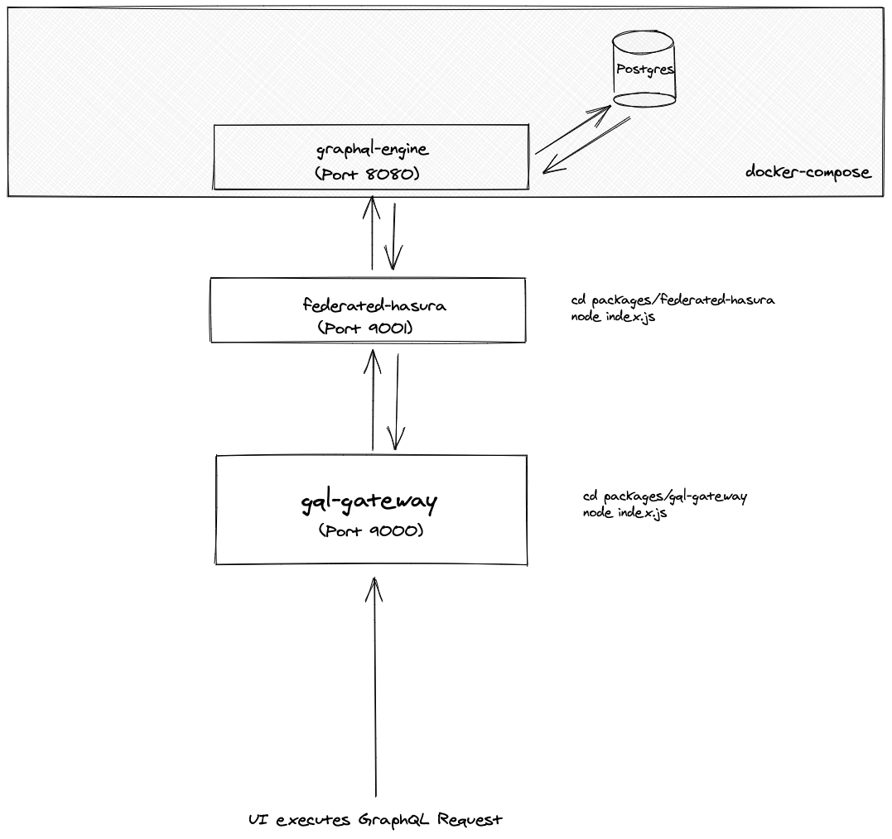

# apollo-federated-hasura-example

Example boilerplate repo of how to use Hasura with Apollo Federation => Gateway.

# Why?
This describes how to use Hasura in an existing GraphQL Server. Note that Hasura does have capabilities to become the defacto all-in-one API, but it lacks some features that I need as of 4/25/2020:

1. Authorization for remote schemas (https://github.com/hasura/graphql-engine/issues/2461)
2. Custom business logic for its own auto-generated methods (Hasura actions requires making new types, new queries).
3. Authorization for actions

In addition, this makes Hasura something that can be added in any Stack gradually, instead of taking over everything all at once.

# Getting Started
1. `yarn`
2. `docker-compose up -d` to start hasura and postgres
3. Run the hasura migrations, `cd hasura && hasura migrate apply`
4. In 1 terminal screen, `cd packages/federated-hasura && node index.js`
5. In 1 terminal screen, `cd packages/gql-gateway && node index.js`
6. Open `http://localhost:9000` and run queries as you wish.

# Flow Diagram

# Features
- Example of deploying a Federated Schema w/ Hasura via [`graphql-transform-federation`](https://github.com/0xR/graphql-transform-federation); hooking up Apollo Gateway to it
- [`graphql-middleware`](https://github.com/prisma-labs/graphql-middleware) example for Federated Hasura Server, which can serve as a validation layer for the existing schema

# TODO
- Put everything into graphql-compose, use hasura-migrations-cli

# Things to note
- Federated operations may not work, I haven't tested it yet.
- Subscriptions will not work because Apollo Gateway does not support Subscriptions!
- Performance of Hasura queries / mutations will be slower as we are hitting 2 servers (Gateway => Federated Hasura) before hitting the Hasura endpoint.

# References
1. https://stackoverflow.com/questions/58303788/hasura-graphql-endpoint-behind-apollo-federated-gateway shows an example of how to do it, but it only stitches the schema, it doesn't make the schema executable.
2. Flow diagram made with [Excalidraw](https://excalidraw.com/)
3. Subscription support: https://github.com/apollographql/apollo-server/issues/2360#issuecomment-531849628